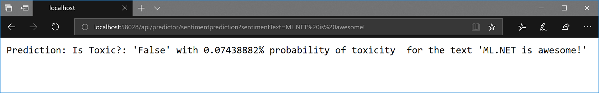

# How to optimize and run ML.NET models on scalable ASP.NET Core WebAPIs or web apps

## Context

**This posts explains how to optimize your code when running an ML.NET model on an ASP.NET Core WebAPI service.** The code would be very similar when running it on an ASP.NET Core MVC or Razor web app, too.

Eventually, this kind of optimized code might be provided as an *.NET Core Integration Package* comparable to integration packages targeting Entity Framework, SignalR, etc. so it'll be transparent and a lot easier for you.

However, as of today (March 2019 with ML.NET 0.11 Preview), you can make the following implementation which, once done, is encapsulated in a single class that you can very easily re-use across your ASP.NET Core projects. 

**ML.NET model used**: The ML.NET model used in this example is the  model you can train/create with the [Sentiment Analysis Getting Started sample](https://github.com/dotnet/machinelearning-samples/tree/master/samples/csharp/getting-started/BinaryClassification_SentimentAnalysis). But for your convenience, that model is already serialized as a .zip file and already available in this sample code which only focuses on how to better run/score a model in scalable apps.  

**Model running on WebAPI**: Although the ML scenario is not really important in this case (execution optimization), the sample implemented is about running a Sentiment Analysis model on a WebAPI, as show in the following image:




If the provided text in the URL 'sentimentText' parameter was rude, then the % of toxicity would be he high.

**Show me the code**: The sample WebAPI and code explained in this blog post is published [here as an ML.NET Sample](https://github.com/dotnet/machinelearning-samples/tree/master/samples/csharp/end-to-end-apps/ScalableMLModelOnWebAPI)

# Goal

**The goal is to be able to make predictions with an ML.NET model while optimizing the executions by sharing objects across Http requests and implementing code which should be very easy to use/consume by the user when predicting**, like the following line of code that you could write on any ASP.NET Core controller's method or custom service class:

```cs
SamplePrediction prediction = _modelEngine.Predict(sampleData);
```

That's it. Very simple. A single line. The object _modelEngine will be injected into your WebAPI controller's constructor or into your custom class, so you just need to use it. 

Internally, it will be optimized so the object dependencies are cached and shared across Http requests with minimized overhead when creating those objects.


# Background on scalable and multithreaded ASP.NET Core services and apps

ASP.NET Core services and apps are multithreaded applications so they can serve many HTTP requests at the same time.

.NET Core provides a managed thread pool that is managed by the system. As a developer, you don’t need to deal with the thread management. 

As shown in the simplified image below, and ASP.NET Core WebAPI or web app accepts many Http requests which will be handled by that thread pool.


The specifics of the architecture are not exactly the same if you deploy your application into *IIS* or selfhosted by using *Kestrel*, but those differences are not important in this case.

The bottom line here is that when writing code for a multithreaded application such as ASP.NET Core services or apps **your code and objects used in your code need to be *thread-safe* if the same object is going to be shared across multiple threads while updating data in-memory**. The reason is because if you update data within the same shared object from multiple threads, those multiple threads can access to the same address space at the same time. So, they can write to the exact same memory location at the same time causing data corruption and application mal-function.

A code is called *thread-safe* if it is being called from multiple threads concurrently without the breaking of functionalities. 

### This is usually not a problem in regular ASP.NET Core apps

Usually, most of the code and objects you use in an ASP.NET Core WebAPI or app, for instance, objects you instanciate in a controller, are not shared across Http requests because the most common pattern is to use objects you create for each Http requests scope, either with `new` or with [transient lifetime](https://docs.microsoft.com/en-us/aspnet/core/fundamentals/dependency-injection?view=aspnetcore-2.2#service-lifetimes) when using dependency injection in .NET Core, as shown in the following image. Not a problem here:


However, issues can happen if you share objects across threads, for example by using [static member variables](https://docs.microsoft.com/en-us/dotnet/csharp/programming-guide/classes-and-structs/static-classes-and-static-class-members#static-members) or [singleton lifetime](https://docs.microsoft.com/en-us/aspnet/core/fundamentals/dependency-injection?view=aspnetcore-2.2#service-lifetimes) objects in Dependency Injection, as explained later on in this post.

# Minimum C# code needed to run an ML.NET model to make a single prediction

As you can check out on may ML.NET getting started samples at the [ML.NET Samples GitHub repo](https://github.com/dotnet/machinelearning-samples), the basic code you need for loading an already trained and serialized ML.NET model and do a single prediction with it (usually called 'ML model scoring code'), is the following:

```cs
// (*Expensive*) Load ML model from serialized .zip file 
ITransformer mlModel;
using (var stream = new FileStream(modelFilePath, FileMode.Open, FileAccess.Read, FileShare.Read))
{
    mlModel = mlContext.Model.Load(stream);
}

// Create sample data to do a single prediction with it 
SampleObservation sampleData = CreateMySingleDataSample();

// (*Expensive*) Create Prediction Engine
var predictionEngine = mlModel.CreatePredictionEngine<SampleObservation, SamplePrediction>(mlContext);

// Try a single prediction
SamplePrediction predictionResult = predictionEngine.Predict(sampleData);
```

This code looks very atraightforward and simple to use. If you just copy that code and run it on any application (console, desktop, web, etc.) it'll work okay. 

However, the lines of code marked with `(*Expensive*)` in the comments are object instantiations that are significantly 'expensive', meaning that it takes significant time to execute such as a few hundred miliseconds per each call if usign small models (i.e. half a second), but that can increase significantly depending on the size of the ML model.

## You need to improve your ML.NET model scoring code when targeting scalable apps

As you would initially think, improving that execution for a multi-threaded application that will run multiple predictions could be as simple as 'caching' the ML model (`ITransformer`) object and the `PredictionEngine` object, so those objects are instantiaated just once and shared across the upcoming requests, right?

Well, that is partially true, but there are important caveats here and this is the reason why I created this blog post, precisely. ;)


# Sharing the ML model (ITransformer) across HTTP requests in ASP.NET Core 

Therefore, the first optimization you could do would be to cache in memory the ML model object that you loaded from the .zip file, so it can be re-used across many Http requests.

Since the **ML model (ITransformer) object is *thread-safe***, this is not an issue and can be done very easily.

The recommended way to share the ITransfomer object across Http requests is to register it as [singleton lifetime](https://docs.microsoft.com/en-us/aspnet/core/fundamentals/dependency-injection?view=aspnetcore-2.2#service-lifetimes) object in your IoC container for Dependency Injection usage, as shown in the code below:

```cs
Startup.cs

public void ConfigureServices(IServiceCollection services)
{
    //..Other code..

    // Register Types in IoC container for DI

    //MLContext created as singleton for the whole ASP.NET Core app
    services.AddSingleton<MLContext>();

    //ML Model (ITransformed) created as singleton for the whole ASP.NET Core app. Loads from .zip file here.
    services.AddSingleton<ITransformer,
                            TransformerChain<ITransformer>> ((ctx) =>
                        {
                            MLContext mlContext = ctx.GetRequiredService<MLContext>();
                            string modelFilePathName = Configuration["MLModel:MLModelFilePath"];

                            ITransformer mlModel;
                            using (var fileStream = File.OpenRead(modelFilePathName))
                                mlModel = mlContext.Model.Load(fileStream);

                            return (TransformerChain<ITransformer>) mlModel;
                        });
    //..Other code..
}
```

Okay, that would be ready for you so you can inject and use the ML model (ITransformer) object on any object, for instance, by injecting it into any controller's constructor, like in the following code:

```cs
MyController.cs

[Route("api/[controller]")]
[ApiController]
public class MyController : ControllerBase
{
    private readonly MLContext _mlContext;
    private readonly ITransformer _mlModel;
    
    public MyController(MLContext mlContext, ITransformer mlModel)
    {
        // Get the injected objects
        _mlContext = mlContext;
        _mlModel = mlModel;
    }

    //...Other code using the ML model (ITransformer) object...
}

```

If later on, you create a `PredictionEngine` object whenever you need to call `predictionEngine.Predict()`, either by explicitely creating it with `new` or registering it as `Transient` lifetime, that would be safe in ASP.NET Core.

This is approximately the approach taken by this ML.NET tutorial named [How-To: Serve Machine Learning Model Through ASP.NET Core Web API](https://docs.microsoft.com/en-us/dotnet/machine-learning/how-to-guides/serve-model-web-api-ml-net)

However, you can do a lot better because with that initial approach it won't be fully optimized since whenever you get an Http request you'll be creating a new `PredictionEngine` object which, as previously mentioned, is also a pretty 'expensive' operation for scalable applications. 

For achieving better performance in your application when predicting simultaneosuly from multiple threads (like when you handle multiple Http requests from many users) you will need, somehow, to cache the `PredictionEngine` object. But as mentioned, there are important caveats and problems here to solve.


# The problem when running/scoring an ML.NET model in multi-threaded applications

The problem when running/scoring an ML.NET model in multi-threaded applications comes when you want to do single predictions with the PredictionEngine object and you want to cache that object (i.e. as Singleton) so it is being reused by multiple Http requests (therefore it would be accessed by multiple threads). That's is a problem because **the Prediction Engine is not thread-safe** ([ML.NET issue, Nov 2018](https://github.com/dotnet/machinelearning/issues/1718)).

Here's a diagram showing the important ML.NET classes you need to use, the dependecies between them and what kind of object lifetimes are recommended:


If you register the Prediction Engine object as Singleton or Static, you will get into trouble because it is not thread-safe.

You could then think, okay, let's make it static while thread-safe with the [[ThreadStatic] attribute](https://docs.microsoft.com/en-us/dotnet/api/system.threadstaticattribute?view=netcore-2.2)? - Well, using the `[ThreadStatic]` attribute in ASP.NET apps is pretty dangerous. It might initially look that it is working, but write some async code (async/await) in your code and it'll probably stop working. Also, the mainstream approach for object's lifetime in ASP.NET Core is to use DI (Dependency Injection). Using static objects usage sometimes and DI other times would be very confusing, as well. 

If you want to learn more about it, see [this discussion with David Fowler](https://github.com/aspnet/AspNetCore/issues/1371) recommending not to use `[ThreadStatic]` in ASP.NET Core apps.

Other possible approaches could be to use [multi-threading synchronization primitives](https://docs.microsoft.com/en-us/dotnet/standard/threading/overview-of-synchronization-primitives) such as *critical sections*,  *locks*, *mutex*, etc., but those locks would create a bottleneck in your code which won't be optimized for high-scalable scenarios.

# The solution: Use Object Pooling for PredictionEngine objects  

Since a PredictionEngine object cannot be singleton because it is not 'thread safe', a good solution for being able to have 'ready to use' PredictionEngine objects  is to use an object pooling-based approach.

When it is necessary to work with a number of objects that are particularly expensive to instantiate and each object is only needed for a short period of time, the performance of an entire application may be adversely affected. This issue will happen if you instantiate a Prediction Engine object whenever you get an Http request.

An object pool design pattern can be very effective in such cases.

The [object pool pattern](https://en.wikipedia.org/wiki/Object_pool_pattern) is a design pattern that uses a set of initialized objects kept ready to use (a 'pool') rather than allocating and destroying them on demand. 

This 'pooling strategy; is also applicable to othe 'expensive creation resources' like database connections and connection pool solution.

The solution's implementation is based on a higher level class (named MLModelEngine) which is instantiated as singleton and creates the needed infrastructure for such an object pool solution, as shown in the following diagram.


This approach achieves the original goal mentioned at the begining of this article by offering a very simple interface for making predictions: `.Predict()`, like the following line of code that you could write on any ASP.NET Core controller's method or custom service class:

```cs
SamplePrediction prediction = _modelEngine.Predict(sampleData);
```

## Implementing the MLModelEngine and object pool

The class MLModelEngine has three main member objects:

- `MLContext` member object. 
    - Singleton, since MLModelEngine will be used as singleton
- `ITransformer` member object. This is the ML model. 
    - Singleton, since MLModelEngine will be used as singleton
- `ObjectPool<PredictionEngine>` member object: Object Pool of PredictionEngine objects.
    - The ObjectPool is singleton, but each PredictionEngine within the pool will only be used by one thread when needed, then will be returned to the pool when the prediction is done.

The MLModelEngine class implementation is as follows:

```cs
MLModelEngine.cs

public class MLModelEngine<TData, TPrediction> : IMLModelEngine<TData, TPrediction>
                where TData : class
                where TPrediction : class, new()
{
    private readonly MLContext _mlContext;
    private readonly ITransformer _mlModel;
    private readonly ObjectPool<PredictionEngine<TData, TPrediction>> _predictionEnginePool;
    private readonly int _maxObjectsRetained;

    /// <summary>
    /// Exposing the ML model allowing additional ITransformer operations such as Bulk predictions', etc.
    /// </summary>
    public ITransformer MLModel
    {
        get => _mlModel;
    }

    /// <summary>
    /// Constructor with modelFilePathName to load from
    /// </summary>
    public MLModelEngine(string modelFilePathName, int maxObjectsRetained = -1)
    {
        //Create the MLContext object to use under the scope of this class 
        _mlContext = new MLContext();

        //Load the ProductSalesForecast model from the .ZIP file
        using (var fileStream = File.OpenRead(modelFilePathName))
        {
            _mlModel = _mlContext.Model.Load(fileStream);
        }

        _maxObjectsRetained = maxObjectsRetained;

        //Create PredictionEngine Object Pool
        _predictionEnginePool = CreatePredictionEngineObjectPool();
    }

    private ObjectPool<PredictionEngine<TData, TPrediction>> CreatePredictionEngineObjectPool()
    {
        var predEnginePolicy = new PooledPredictionEnginePolicy<TData, TPrediction>(_mlContext, _mlModel);

        DefaultObjectPool<PredictionEngine<TData, TPrediction>> pool;

        if (_maxObjectsRetained != -1)
        {
            pool = new DefaultObjectPool<PredictionEngine<TData, TPrediction>>(predEnginePolicy, _maxObjectsRetained);
        }
        else
        {
            //default maximumRetained is Environment.ProcessorCount * 2, if not explicitly provided
            pool = new DefaultObjectPool<PredictionEngine<TData, TPrediction>>(predEnginePolicy);
        }

        return pool;
    }

    public TPrediction Predict(TData dataSample)
    {
        //Get PredictionEngine object from the Object Pool
        PredictionEngine<TData, TPrediction> predictionEngine = _predictionEnginePool.Get();

        try
        {
            //Predict
            TPrediction prediction = predictionEngine.Predict(dataSample);
            return prediction;
        }
        finally
        {
            //Release used PredictionEngine object into the Object Pool
            _predictionEnginePool.Return(predictionEngine);
        }
    }
}

```

What's related to the MLContext and ITransformer objects is pretty straightforward. The 'special code' here is related to the Object Pool.

### Object Pool implementation: ObjectPool<T>

The implementation of the object pool is not using a custom object pool approach but an official class provided by Microsoft in the [Microsoft.Extensions.ObjectPool namespace](https://docs.microsoft.com/en-us/dotnet/api/microsoft.extensions.objectpool) which is part of .NET Core.

The object pool class used is the [ObjectPool<T>](https://docs.microsoft.com/en-us/dotnet/api/microsoft.extensions.objectpool.objectpool-1), so we can use it as:

`ObjectPool<PredictionEngine<TData, TPrediction>> _predictionEnginePool;`

Meaning an object pool of `PredictionEngine` objects using generics so you can provide your particular `SampleObservation` and `SamplePrediction` data classes.  

The object pool usage is pretty straightforward in the Predict() method:

```cs
public TPrediction Predict(TData dataSample)
{
    //Get PredictionEngine object from the Object Pool
    PredictionEngine<TData, TPrediction> predictionEngine = _predictionEnginePool.Get();

    try
    {
        //Predict
        TPrediction prediction = predictionEngine.Predict(dataSample);
        return prediction;
    }
    finally
    {
        //Release used PredictionEngine object into the Object Pool
        _predictionEnginePool.Return(predictionEngine);
    }
}
```

Basically, whenever the Predict() method is called, you take a PredictionEngine from the pool, use it to predict and then return it to the pool so it is available for any upcoming request.

If there's not any PredictionEngine object available in the pool (that will happen the first time you use the pool or if under pressure with many Http requests), then the pool needs to create a PredictionEngine object.

Basically, you have now to solve the following question:

*"How do you tell the object pool how the PredictionEngine object has to be created whenever a new instance is needed in the object pool?"*

You do that by using an ObjectPool *Policy* specified when creating the object pool in the `CreatePredictionEngineObjectPool()` method which is run once from the constructor, as in the following simplified code:

```cs
private ObjectPool<PredictionEngine<TData, TPrediction>> CreatePredictionEngineObjectPool()
{
    var predEnginePolicy = new PooledPredictionEnginePolicy<TData, TPrediction>(_mlContext, _mlModel);

    var pool  = new DefaultObjectPool<PredictionEngine<TData, TPrediction>>(predEnginePolicy);
    
    return pool;
}
```

Then, in the Policy class you define how the PredictionEngine will be created, which is by invoking our 'well known' `ITransformer.CreatePredictionEngine()` method:

```cs
public class PooledPredictionEnginePolicy<TData, TPrediction> : IPooledObjectPolicy<PredictionEngine<TData, TPrediction>>
                where TData : class
                where TPrediction : class, new()
{
    private readonly MLContext _mlContext;
    private readonly ITransformer _model;
    public PooledPredictionEnginePolicy(MLContext mlContext, ITransformer model)
    {
        _mlContext = mlContext;
        _model = model;
    }

    public PredictionEngine<TData, TPrediction> Create()
    {
        var predictionEngine = _model.CreatePredictionEngine<TData, TPrediction>(_mlContext);

        return predictionEngine;
    }

    public bool Return(PredictionEngine<TData, TPrediction> obj)
    {
        if (obj == null)
            return false;

        return true;
    }
}
```

## Registering the MLModelEngine class as singleton for DI (Dependency Injection)

For using this system in your ASP.NET Core WebAPI or web app you just need to register the MLModelEngine class as singleton in the DI system through the `services` collection at the `Startup.cs` like in the following code:

```cs
public void ConfigureServices(IServiceCollection services)
{
    // ...Other code...

    // Register as singleton in the IoC container for DI
    services.AddSingleton<MLModelEngine<SampleObservation, SamplePrediction>>((ctx) =>
                            {
                                string modelFilePathName = GetAbsolutePath(Configuration["MLModel:MLModelFilePath"]);
                                return new MLModelEngine<SampleObservation, SamplePrediction>(modelFilePathName);
                            });
}
```

Since we need the filepath pointing to the model's .ZIP, we're using a lambda function as a factory to be able to provide that info to the constructor.

## Using the injected MLModelEngine object from your WebAPI controllers to make predictions

Using the injected MLModelEngine object from your WebAPI controllers to make predictions is very simple.

First, the MLModelEngine object is injected in the controller's constructor.

Second, you simple use it by calling the .Predict() method, as in the following controller's code for a sentiment prediction example:

```cs
[Route("api/[controller]")]
[ApiController]
public class PredictorController : ControllerBase
{
    private readonly MLModelEngine<SampleObservation, SamplePrediction> _modelEngine;

    public PredictorController(MLModelEngine<SampleObservation, SamplePrediction> modelEngine)
    {
        // Get the ML Model Engine injected, for scoring
        _modelEngine = modelEngine;
    }

    // GET api/predictor/sentimentprediction?sentimentText=ML.NET is awesome!
    [HttpGet]
    [Route("sentimentprediction")]
    public ActionResult<string> PredictSentiment([FromQuery]string sentimentText)
    {
        SampleObservation sampleData = new SampleObservation() { SentimentText = sentimentText };

        //Predict sentiment
        SamplePrediction prediction = _modelEngine.Predict(sampleData);

        return retVal = prediction.IsToxic.ToString();
    }
}
```

With that, we achieved our original goal of *'making super simple to predict with an ML.NET model while having good performance in scalable ASP.NET Core apps'* thanks to the explained optimizations.


Happy coding! :)


# References

[Dependency injection in ASP.NET Core](https://docs.microsoft.com/en-us/aspnet/core/fundamentals/dependency-injection)

[Managed threading best practices](https://docs.microsoft.com/en-us/dotnet/standard/threading/managed-threading-best-practices) 

[Overview of synchronization primitives](https://docs.microsoft.com/en-us/dotnet/standard/threading/overview-of-synchronization-primitives)

[Use the PredictionEngine to make one prediction at a time - ML.NET](https://docs.microsoft.com/en-us/dotnet/machine-learning/how-to-guides/single-predict-model-ml-net)
