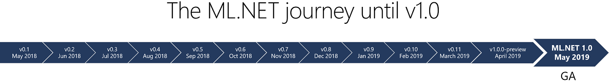
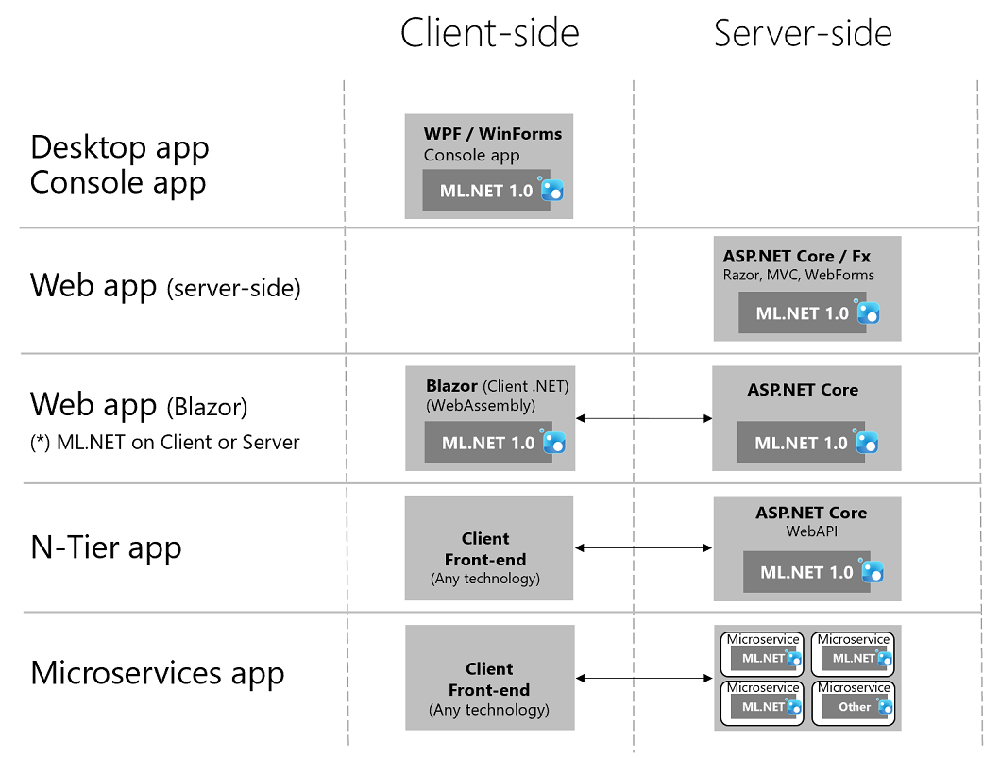

# What is ML.NET 1.0 - Machine Learning for .NET 


 Today, coinciding with the //BUILD 2019/ conference, we’re thrilled by launching [ML.NET](http://dot.net/ml) 1.0 release! 
 
 You can read the [official ML.NET 1.0 release Blog Post here](https://aka.ms/mlnet1-announcement-blog-post) and get started at the [ML.NET  site here](https://dotnet.microsoft.com/apps/machinelearning-ai/ml-dotnet). 

 In this blog post I'm providing quite a few additional technical details along with my personal vision that you might find interesting, though. 
 
 This is the first main milestone of a great journey in the open that started on [May 2018 when we released ML.NET 0.1 as open source](https://blogs.msdn.microsoft.com/dotnet/2018/05/07/introducing-ml-net-cross-platform-proven-and-open-source-machine-learning-framework/). Since then we've been releasing monthly, 12 preview releases plus this final 1.0 release, as shown in the roadmap below:



The diagram above shows the the development in the open of ML.NET, however, as explained below, ML.NET has been internally used by Microsoft for quite a few years and used by other Microsoft products such as *Bing Ads, Office, Windows, Azure*, etc.

# What is ML.NET?

[ML.NET](http://dot.net/ml) is an **open-source** and **cross-platform** machine learning framework (Windows, Linux, macOS), created by Microsoft, **for .NET developers**. 

Using [ML.NET](http://dot.net/ml), developers can leverage their existing tools and skillsets to develop and infuse custom AI into their applications by creating **custom machine learning models** for common scenarios like *Sentiment Analysis, Recommendation, Image Classification* and many more!.


# ML.NET 1.0 Architecture

Below you can see a high level architecture diagram and after it you can read additional details about what's supported, what's not and other architecture explanations.


### Supported in ML.NET 1.0

**Operating system and framework support:**

- Windows, Linux, and macOS using .NET Core

- Windows using .NET Framework. 

**Hardware / Processor architecture support**

- x64 bit is supported on all platforms. 
- x86 is supported on Windows, except for TensorFlow, LightGBM, and ONNX related functionality.

**.NET versions support**

- .NET Core 2.1 or later is supported. 

- .NET Framework 4.6.1 or later is supported, but 4.7.2 or later is recommended.

- .NET Stardard 2.x (best choice for class libraries). 

### Not supported in ML.NET 1.0

ML.NET 1.0 is currently not supported on ARM processor architecture, impacting Xamarin apps (iOS, Android) and ARM-based IoT devices, although you can always run the ML models in the 'server side'. UWP and Unity are also still not supported. However, in upcoming releases the roadmap plan is to support all these technologies, as well.

ML.NET 1.0 can work on UWP apps and Unity after some hacking, but they are still not officially supported, yet.

## End-user Application Architecture

ML.NET 1.0 is composed by a [set of NuGet packages](https://www.nuget.org/packages?q=Microsoft.ML). Therefore you can use it  within your own .NET application wherever it is running (on-premises, cloud, client, server, etc.). 

You can run ML.NET 1.0 NuGet packages as part of the following common  application workload types:

- ASP.NET Core web apps & WebAPI services
- ASP.NET web apps & WebAPI services
- Azure Functions 
- Any other Azure app model app (server side)
- .NET WPF desktop app
- .NET WinForms desktop app
- .NET Core console app (usually for ML model training)
- .NET Framework console app (usually for ML model training)

Those are the most common application types, but there are additional app types you can run ML.NET 1.0 on as long as they are supported on the mentioned architecture processors and OS above.

Here's a high-level diagram with multiple possible application architectures when running ML.NET models.



(*) Note that even when with Blazor you can run ML.NET on the browser (because with Blazor client you can run .NET assemblies and code on the browser), if the browser running the web app is on a mobile device (ARM processor: iOS/Android), the ML.NET model won't run. ML.NET 1.0 will run only if the browser runs on x64/x86 devices. 

There might be additional architecture possibilities, but those are probably the most common.

# Why would you want to use ML.NET?


## Create custom and specialized ML models for your business scenarios and data

In the general AI ecosystem you have on one hand *'Pre-built AI'* services such as *Azure Cognitive Services* which in many cases might be enough for your AI scenarios. 

However, on the other hand there are many other cases where you need to create your own custom ML model especially made for your business problems and trained with your own data. This second case is known as *'Custom AI'*. This is when a framework like ML.NET should be used.

ML.NET is a 'code-first' machine learning framework that allows you to create your own ML models by training them with your own data while taking advantage of a great flexibility and customization by being able to deep dive and select the ML algorithms and approaches you consider better for your business.

## Runs as native .NET execution (For model scoring and training)

If your end-user applications are based on .NET, the advantage of ML.NET compared to other ML frameworks based on Python or other languages is that you can natively run your ML models on .NET apps. In most cases that means better performance when running predictions and a much lower cost of operationalization when deploying your ML models in production apps for end-users based on .NET such as ASP.NET, ASP.NET Core, desktop apps, etc.

## Familiar .NET skills

If your development skills are fundamentally based on .NET (C#, F#, VB), you will be able to create machine learning models without needing to learn other languages.

# Machine Learning Scenarios you can create with ML.NET

There are hundreds of ML scenarios you can implement with ML.NET. The following are only a few example scenarios you can implement:


All these scenarios and many more can be mapped to the following **ML Tasks** you can implement with ML.NET for your models:

- Binary Classification
- Multi-Class Classification
- Regression
- Recommendation
- Anomaly Detection and Time Series
- Clustering
- Ranking
- Deep Learning (Integration with TensorFlow and ONNX models)


# Production ready

ML.NET was originally developed by Microsoft as an internal framework for .NET and evolved over the last decade; it is a production-proven framework because it is currently used across many products in Microsoft like **Windows, Bing, Azure, Office, PowerBI** and many more.


In early 2018 Microsoft decided to make it available as a framework for customers. Since May 2018 when releasing its first preview release, we've been polishing a new API easier to use by developers, while creating documentation and samples. However, the main core engine and proven ML algorithms are mostly the same battle-proved artifacts used by Microsoft teams for quite a few years.

You can also check out additional showcased customers who are currently using it [here](https://dotnet.microsoft.com/apps/machinelearning-ai/ml-dotnet/customers)

# Main components in ML.NET

ML.NET is being launched as a part of the .NET Foundation and the repo today contains the .NET API(s) for both model training and consumption, along with a variety of transforms and learners required for many popular ML tasks like regression and classification, as shown in the following diagram.


ML.NET is aimed at providing the E2E workflow for infusing ML into .NET apps across pre-processing, feature engineering, modeling, evaluation, and operationalization.

ML.NET comes with support for the types and runtime needed for all aspects of machine learning, including core data types, extensible pipelines, data structures for tabular data, AutoML (explained below in further details), tooling support, and more.

# Creating/training and running ML.NET models

The high level machine learning process using ML.NET can be simplified as the following diagram illustrates:


You can see how there are two very differenciated workflows:

- Cyclic workflow to create/train/evaluate the ML model based on historic data. When you are happy with the model's quality, you save it as a serialized ML.NET model file (.zip format).

- Run/deploy your custom trained ML model in your end-user application to perform predictions.

The ML.NET NuGet packages runs on all those processes, as shown in the diagram. Since ML.NET is a framework, you can run it on the environment and application type you want. 

## Getting Started Installation

You can follow the official guided ['ML.NET Getting started Tutorial'](). However, below I'm highlighting the main steps to take into account and common C# code to use.

To get started with ML.NET, install the ML.NET NuGet from the CLI using:

```cs
dotnet add package Microsoft.ML
```

From package manager:
```cs
Install-Package Microsoft.ML
```

## Train your own ML model

Here is a simplified code snippet to train a model for sentiment analysis classification that you can run for instance on a console app (full sample can be found [here](https://github.com/dotnet/machinelearning-samples/tree/master/samples/csharp/getting-started/BinaryClassification_SentimentAnalysis)).

```cs
// Create MLContext
MLContext mlContext = new MLContext();

// Load training data
IDataView trainData = mlContext.Data.LoadFromTextFile<SentimentIssue>(DataPath);

// Data transformations needed for the machine learning algorithms
var dataProcessPipeline = mlContext.Transforms.Text.FeaturizeText(outputColumnName:"Features", inputColumnName:"Text");

// Set the training algorithm
var trainer = mlContext.BinaryClassification.Trainers.FastTree(labelColumnName:"Label", featureColumnName:"Features");
var trainingPipeline = dataProcessPipeline.Append(trainer);

// Train the model fitting to the training DataSet
ITransformer trainedModel = trainingPipeline.Fit(testTrainSplit.TrainSet);
```

Let’s go through this in a bit more detail. We create an MLContext needed for all ML operations when loading data, transforming data and applying the algorithm. These are the steps required to train a machine learning model.

The second step is to load data with `LoadFromTextFile()` which loads the data from our training file into a IDataView structure. We then apply a FeaturizeText() to convert the 'Text' column into a numeric vector called 'Features' which can be used by the machine learning algorithm (as algorithms only work with number-based structures). This is our preprocessing/featurization step.

FastTree is the trainer (algorithm) we use in this pipeline. Like the featurization step, trying out different trainers available in ML.NET and changing their parameters may enable identifying better results. 

Finally, trainingPipeline.Fit(testTrainSplit.TrainSet) trains the model with the training dataset. The whole process/experiment is not executed until this train/fit method happens.

## Consuming ML.NET models in your end-user apps

Consuming a model to run predictions is very straightforward and can be done in a couple of lines:

```cs
// Create prediction engine related to the loaded trained model
var predEngine= trainedModel.CreatePredictionEngine<SentimentIssue, SentimentPrediction>(mlContext);

//Get sample data to make a prediction with
SentimentIssue sampleComment = new SentimentIssue { Text = "This is a very rude movie!" };

// Predict
var resultprediction = predEngine.Predict(sampleComment);
```

From the resultPrediction object you can get the actual `Prediction` (in this case `PositiveSentiment = true/false`) and the `Probability`.


# ML.NET Tools and Extensions (in Preview)

## Automatically create/train models with ML.NET AutoML

Machine Learning in general and any ML framework in particular can be challenging for .NET developers who are not data scientists because of the needed skills about ML algorithms and special data transformations and configuration settings like algorythm's hyperparameters.

ML.NET AutoML eliminates the task of selecting different algorithms, hyperparameters. AutoML will intelligently generate many combinations of algorithms and hyperparameters. It means as a user, you do not need to know or understand what each of these algorithms are and which one you need to use. Simply bring your dataset and let AutoML build a Machine Learning model for you.

You can use AutoML in ML.NET through three different alternatives. API, CLI and UI/VisualStudio, as shown in the diagram below:


In most developers, the most common and easier way to get started is to use either the CLI or Visual Studio. However, for scenarios where you need to generate an ML model 'on the fly' (such as from a product), AutoML API would be the right choice.  

## ML.NET CLI (Command-Line Interface) - Preview

The ML.NET CLI (command-line interface) is a tool you run on any command-prompt (Windows, Mac or Linux) for generating good quality ML.NET models and source code based on training datasets you provide. It is internally using ML.NET AutoML, so you can create good quality models and generate related C# code directly from the command-line.

The ML.NET CLI is part of ML.NET and its main purpose is to "democratize" ML.NET for .NET developers when learning ML.NET so it is very simple to get the right C# code to create a good quality ML.NET model and the sample C# code to run/score the model. In addition, you can generate a good quality model file (.zip file) without coding, so it also improves your productivity even if you already know ML.NET.

Currently, the ML Tasks supported by the CLI are the same than with AutoML:

- Regression
- Binary Classification
- Multi-class Classification

Other ML Tasks in the future such as recommendation, anomaly detection, clustering, etc. will be supported.

Here's how easy is to use the ML.NET CLI to automatically generate an ML model plus its related C# code (to run it and the C# code that was used to train it).


After that CLI execution, you get the serialized ML.NET model in a .zip file plus the C# code:


In that generated C# code you get the model consumption code that you can directly use in your end-user application to make predictions. That code is very similar to the three lines explained above for running/scoring a model, but in this case the code is running your own generated ML model.

In addition and for more advanced leearning, you also get the C# training code that was used to train the model by the CLI tool so you can research that code, as well.  

# ML.NET Model Builder for Visual Studio - Preview

**ML.NET Model Builder for Visual Studio** is currently an .VSIX Visual Studio extension you can [install from here](https://aka.ms/mlnettemplates) 

Its initial functionality is pretty similar than the functionality provided by the CLI but guided on a visual UI from Visual Studio. Therefore it allows you to automatically create/train a custom model but starting from your end-user application solution in Visual Studio, as in the following screenshot series:

## Using ML.NET Builder in Visual Studio


For further information on **ML.NET Model Builder for Visual Studio** usage go [here](https://aka.ms/mlnettemplates)

## AutoML API - Preview

ML.NET AutoML API is basically a set of libraries packaged as a NuGet package you can use from your .NET code. 

Currently, the ML Tasks supported by AutoML are:

- Regression
- Binary Classification
- Multi-class Classification

Here is a simplified code snippet to train a model with AutoML and predict with it afterwards.

```cs
TextLoader textLoader = mlContext.Data.CreateTextLoader(textLoaderOptions);
IDataView trainDataView = textLoader.Load(TrainDataPath);

// Auto featurize, auto train and auto hyperparameter tune
IEnumerable<RunDetails<BinaryClassificationMetrics>> runDetails = mlContext.Auto()
                                                                    .CreateBinaryClassificationExperiment(ExperimentTime)
                                                                    .Execute(trainDataView);

RunDetails<BinaryClassificationMetrics> best = runDetails.Best();

ITransformer trainedModel = best.Model;
```

In the previous code using AutoML you can observe that you don't need to select any specific algorithm/trainer for your desired ML task, not even need to specify any explicit data transformation. All that complexity is don for you by AutoML.

You simply provide the data, specify the type of ML task experiment, and that's all.

Then, the prediction execution using the generated model would be the same code as when simply using ML.NET to run a model in the previous ML.NET sample.

# Running your models on ASP.NET Core web apps and services

When scaling out and running your models on multi-threaded applications, the way you should run your models for executing predictions should be implemented in a slightly different way so it is optimized for multi-threaded environments. The problem is explained in detail in this blog post I wrote: 

*Blog Post: [How to optimize and run ML.NET models on scalable ASP.NET Core WebAPIs or web apps](https://devblogs.microsoft.com/cesardelatorre/how-to-optimize-and-run-ml-net-models-on-scalable-asp-net-core-webapis-or-web-apps/)*

However, having to implement such a 'plumbing infrastructure' explained in that blog post, based on a thread-safe object pool of Prediction Engines by yourself might significantly complicate your development.

The good news is that we've also been working on this concern and we are providing a new '.NET Core Integration Package' in Preview that greatly simplifies the way you can run ML.NET models in scalable and multi-threaded apps or services (usually ASP.NET Core and any .NET Core app using dependecy injection). 

## Microsoft.Extensions.ML and the PredictionEnginePool

That mentioned '.NET Core Integration Package for ML.NET' (Preview) is currently named as Microsoft.Extensions.ML NuGet package.

This library allows to run/score ML.NET models very easily while getting high optimization for ASP.NET Core web apps, WebAPIs or even for any .NET Core process using Dependency Injection.

You might be familiar when using comparable integration packages such as when using EF (Entity Framework) or SignalR. For instance, the following code-snippet shows how you register EF in the ASP.NET Core services:

```cs
Startup.cs from your ASP.NET Core app/service

public void ConfigureServices(IServiceCollection services)
{
   services.AddMvc();
   
    var connection = @"<YOUR-DATABASE-CONNECTION-STRING>";
    services.AddDbContext<MyDbContext>
        (options => options.UseSqlServer(connection));
}
```

Then you would use the DbConext injected from any ASP.NET Controller or class.

In a similar way, with this new .NET Core integration package for ML.NET you can register the Prediction Engine infrastructure like in the following code:

```cs
//Startup.cs from your ASP.NET Core app/service

using Microsoft.Extensions.ML;
//... Other code
public void ConfigureServices(IServiceCollection services)
{
   services.AddMvc();
   //...
   services.AddPredictionEnginePool<ModelInput, ModelOutput>()
                    .FromFile(Configuration["MyModel.zip"]);
}
```

With this straightforward registration, you can now make predictions by using the Prediction Engine infrastructure injected in the constructors of your controllers or service classes, such as the following code:

```cs
MyController.cs from your ASP.NET Core app/service

[Route("[controller]")]
[ApiController]
public class PredictionController : ControllerBase
{
   private PredictionEnginePool<ModelInput, ModelOutput> _predictionEnginePool;

   //The predictionEnginePool is injected through the constructor
   public PredictionController(PredictionEnginePool<ModelInput, ModelOutput> predictionEnginePool)
   {
      _predictionEnginePool = predictionEnginePool;
   }

   [HttpPost()]
   public ActionResult<SentimentPrediction> GetSentiment(SentimentObservation inputDataSample)
   {
      return _predictionEnginePool.Predict(inputDataSample);
   }
}
```

It is that simple while getting an optimized and thread-safe ML.NET prediction infrastructure for multi-threaded ASP.NET Core apps. Please, try it out and give us feedback.

You can find and end-to-end WebAPI sample running an ML.NET model by using the Microsoft.Extensions.ML, here:

- [ASP.NET Core WebAPI sample optimized for scalability and performance when runnig/scoring an ML.NET model](https://github.com/dotnet/machinelearning-samples/tree/master/samples/csharp/end-to-end-apps/ScalableMLModelOnWebAPI-IntegrationPkg)

# Positioning ML.NET with other ML frameworks

If you are looking for any comparison with other existing ML frameworks, I'd say that  **Scitkit-Learn** (Python-based) is probably the framework with most similar machine learning capabilities. Scitkit-Learn is a great ML framework for Python developers that also runs on Microsoft platforms such as Azure.

The biggest difference lays on the fact that ML.NET is "native .NET" and targets .NET developers primarily. 

ML.NET also provides **bindings for Python** (named **[NimbusML](https://docs.microsoft.com/en-us/nimbusml/overview)**) which is currently an experimental solution. This is a collateral scenario that can be useful for data scientists working on Python and collaborating with .NET developers through the same ML.NET models. But, as previously mentioned, ML.NET targets .NET developers as the main user or 'persona'.

# Get started with ML.NET 1.0!


This current blog post is providing significant technical details. For a simpler ML.NET 1.0 release announcement, check out the [official ML.NET 1.0 announcement Blog Post here](https://aka.ms/mlnet1-announcement-blog-post).

Get started with ML.NET by exploring the following resources:

  * **Get started** with <a href="https://www.microsoft.com/net/learn/apps/machine-learning-and-ai/ml-dotnet/get-started">ML.NET here</a>. 
  * **Tutorials** and resources at the [Microsoft Docs ML.NET Guide](https://docs.microsoft.com/en-us/dotnet/machine-learning/)
  * **Sample apps** using ML.NET at the [machinelearning-samples GitHub repo](https://github.com/dotnet/machinelearning-samples)


Thanks and happy coding with [ML.NET](http://dot.net/ml)!

*Cesar de la Torre*

*Principal Program Manager*

*.NET and ML.NET product group*

*Microsoft Corp.*

