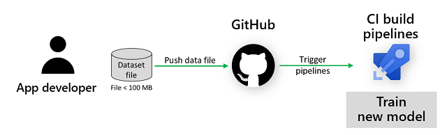
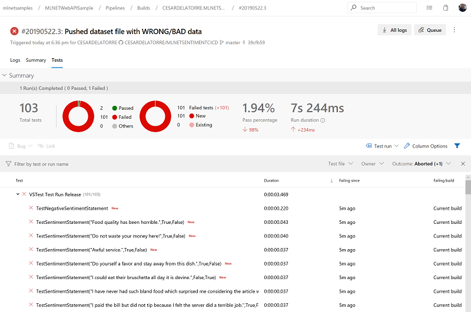
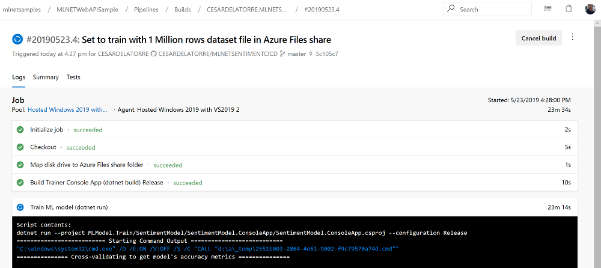

# ML.NET Model Lifecycle with Azure DevOps CI/CD pipelines 


As a developer or software architect, you are focused on the application lifecycle – building, maintaining, and continuously updating the end-user business application, as illustrated in the simplified image below:


When you infuse AI (such as an ML.NET model) into your application, then your application lifecycle needs to be extended so it additionally embraces the 'Machine Learning Model Lifecycle'.

# Extending Azure DevOps CI/CD pipelines with the ML Model lifecycle

When deploying ML models to production, you need to automate the process to track,  version, audit,  certify and re-use every asset in your ML model lifecycle along with the end-user application lifecycle.

Essentially, you have to extend your *DevOps CI/CD pipelines* (in this case using **Azure DevOps**) to handle not just your end-user application but also the ML model generation, traning, testing, evaluation and automatic deployment as detailed in the following workflow illustration:


In short, the ML model lifecycle process must be part of the application’s Continuous Integration (CI) and Continuous Delivery (CD) pipelines.


---

**NOTE**: *This blog post explains a simple approach you can take for just getting started with ML.NET models lifecycle by using Azure DevOps CI/CD pipelines. However, there are important areas that would need to be addressed for a real production DevOps workflow targeting ML models trained with large datasets such as:* 
    
*1. Training the model in specialized environments (dedicated VMs, dedicated self-hosted Azure DevOps Agents  and/or through Azure ML)* 
    
*2. Versioning dataset files and models  
    
*I'm not covering those advanced scenarios in this blog post but those points are mentioned in further details as areas of improvement at the end of the blog post plus I'll continue writing blog posts about it in the future.*

---

Let’s walk through the diagram above to understand how this integration between the ML model lifecycle and the app development lifecycle can be achieved.

For this common scenario, a starting assumption is that Git is used as your code repository, but it could be any other source code management platform. 

In the same way that the app developer makes changes in an application, pushes code to Git to trigger builds and application tests in the CI pipeline, followed by the application deployment in the CD pipeline, the ML application needs a similar process.

Any changes made in the training code or changes in training data will trigger the Azure DevOps CI build pipeline to compile the trainer app, train a new ML model, run unit tests validating the quality of that ML model, deploy the ML model file into the end-user application and finally end up by deploying the application through the CD release pipeline.

You retain full control over the ML model training. You can continue to write and train models in your favorite  environment when developing or experimenting (data wrangling, feature extraction, and algorithm/trainer). Then, you get to decide when to refresh the data or change the training code by pushing into Git to trigger the 'official' training of the ML model to be deployed into the end-user application. 

At the same time, you can sleep comfortably knowing that any changes you commit will pass through the required unit, integration testing, and optional human approval steps (releases to production from Azure DevOps Release Manager) for the overall application.

# The sample ML model and sample ASP.NET Core WebAPI service for this blog post

In order to make this blog post simple and mostly focus on DevOps CI/CD, the [ML.NET](https://dotnet.microsoft.com/apps/machinelearning-ai/ml-dotnet) model and sample app/service to be deployed must be kept simple while with enough implementation so it is useful.

But the goal is not to have a large explanation about the ML model implementation since there are other tutorials I point to for that purpose. 

## Sample ML Model: Sentiment Analysis model (Binary Classification) created with the ML.NET CLI

The sample ML model and even its related trainer console app were created with the ML.NET CLI. In fact, you could create the same ML Model and trainer console app by following this [ML.NET CLI tutorial](https://docs.microsoft.com/en-us/dotnet/machine-learning/tutorials/mlnet-cli?tabs=windows).

This is basically the code generated by the CLI in that tutorial and what we're going to use as sample ML model and trainer console app for the CI pipeline:


However, you don't need to generate/create that code following the mentioned tutorial since I'm also making it available in the GitHub repo related to this Blog Post, here:

- [Yelp reviews-sentiment dataset with added header in the file](https://github.com/CESARDELATORRE/MLNETSENTIMENTCICD/blob/master/MLModel.Train/Data/yelp_labelled.tsv)


- [CLI command used to generate model and code](https://github.com/CESARDELATORRE/MLNETSENTIMENTCICD/blob/master/MLModel.Train/CLI-Commands.txt) 

- [Source code of trainer console app and Sample ML model](https://github.com/CESARDELATORRE/MLNETSENTIMENTCICD/tree/master/MLModel.Train/SentimentModel)

## Sample ASP.NET Core WebAPI service

The end-user app where you want to deploy the ML model is in this case a very simple ASP.NET Core WebAPI service. The code is available in the same GitHub repo:

- [Source code of sample end-user ASP.NET Core WebAPI service](https://github.com/CESARDELATORRE/MLNETSENTIMENTCICD/tree/master/Scalable.WebAPI)

You can also explore a very similar WebAPI implementation running an ML.NET model in this 'how to' guide:

- [Deploy a model in an ASP.NET Core Web API](https://docs.microsoft.com/en-us/dotnet/machine-learning/how-to-guides/serve-model-web-api-ml-net).

Having the ML model, trainer console app and final app/service to deploy the model to, let's now drill down on the different CI/CD pipelines in Azure DevOps and learn multiple approaches you can implement.

# Build pipeline in Azure DevOps including the ML.NET Model lifecycle

The Build pipeline for machine Learning is pretty similar to regular application Build pipelines, but you need to add the following steps:

- Build/compile the ML model trainer app (Usually a console app)
- Run the process (console app) to train the ML.NET model and generate the serialized model (.zip file).
- Run model's tests (model quality validation)
- Deployment the model file into the actual end-user application code (project structure)

Once you run those tasks in the CI pipeline then you'd follow the typical application build tasks such as:

- Build/compile the end-user app (such as an ASP.NET Core web app or WebAPI service)
- Run app's unit tests and integration tests
- Generate and publish the final pipeline artifact in Azure DevOps (or if using containers, generate a Docker image and publish it into a Docker Registry)

Here's a screenshot of a simplified approach of an Azure DevOps CI pipeline including all those steps.


**Azure DevOps Build pipeline (Visual tasks approach)**


I published this Azure DevOps publicly as READ-ONLY, so you can also see how it runs, here:

- [Public access (Read-only) of Azure DevOps CI pipeline (Visual tasks approach)](https://dev.azure.com/mlnetsamples/MLNETWebAPISample/_build?definitionId=9)
 

Note that for the "first look" above I'm showing a visual "task-based" CI pipeline because it is clearer and more visual for a first quick look, but in the upcoming detailed steps we switch to a YAML pipeline (**Azure-Pipelines.yaml**) because it offers better tracking with its related source code since the .YAML file is also checked in and pushed into the same Git repo used for the artifacts source code.

## Build pipeline in Azure DevOps (YAML approach) to build and deploy the ML.NET model

In order to get started with Azure DevOps and Azure pipelines (YAML-based) and link it with your source code in GitHub, check this simple tutorial:

- [Create your first pipeline](https://docs.microsoft.com/en-us/azure/devops/pipelines/create-first-pipeline?view=azure-devops&tabs=tfs-2018-2)

Once you have an empty Azure pipeline, you can start implementing it as the following.

This is pretty much the same build pipeline than the previous one but in this case it is using YAML as a **Azure-Pipelines.yaml** file, which you can also see published at my GitHub repo here:

https://github.com/CESARDELATORRE/MLNETSENTIMENTCICD/blob/master/azure-pipelines.yml

```yaml
# Build/CI pipeline for ML.NET model, its trainer app and end-user WebAPI service

trigger:
- master

pool:
  vmImage: 'ubuntu-latest'

variables:
  buildConfiguration: 'Release'

steps:

- script: dotnet build MLModel.Train/SentimentModel/SentimentModel.ConsoleApp/SentimentModel.ConsoleApp.csproj --configuration $(buildConfiguration)
  displayName: 'Build Trainer Console App (dotnet build) $(buildConfiguration)'

- script: dotnet run --project MLModel.Train/SentimentModel/SentimentModel.ConsoleApp/SentimentModel.ConsoleApp.csproj --configuration $(buildConfiguration)
  displayName: 'Train ML model (dotnet run)'

- script: dotnet build MLModel.Train/UnitTests/UnitTests.csproj --configuration $(buildConfiguration)
  displayName: 'Build Test project for ML Model (dotnet build) $(buildConfiguration)'

- task: DotNetCoreCLI@2
  displayName: 'Run Unit Tests using trained ML model'
  inputs:
    command: test
    projects: '**/UnitTests.csproj'
    arguments: '--configuration $(buildConfiguration)'

- task: CopyFiles@2
  displayName: 'Copy ML model file from Trainer app to WebAPI app'
  inputs:
    SourceFolder: 'MLModel.Train/SentimentModel/SentimentModel.Model'
    Contents: 'MLModel.zip'
    TargetFolder: 'Scalable.WebAPI/ML'
    OverWrite: true

- script: dotnet build Scalable.WebAPI/Scalable.WebAPI.csproj --configuration $(buildConfiguration)
  displayName: 'Build WebAPI service (dotnet build) $(buildConfiguration)'

- task: DotNetCoreCLI@2
  displayName: 'Generate WebAPI binaries (dotnet publish)'
  inputs:
    command: publish
    publishWebProjects: false
    projects: Scalable.WebAPI/Scalable.WebAPI.csproj
    arguments: '--configuration $(buildConfiguration) --output $(Build.ArtifactStagingDirectory)'
    modifyOutputPath: false

- task: PublishPipelineArtifact@0
  displayName: 'Publish WebAPI as pipeline artifact'
  inputs:
    artifactName: MLNETWebAPI
    targetPath: '$(Build.ArtifactStagingDirectory)'
```

Initially, all the .YAML code can look a bit overwhelming compared to the traditional VSTS visual tasks, but once you know the tasks you are running, the .YAML approach is much more direct and in a single scan/read you see everything the pipeline is running. On the other hand, if using the visual tasks you'd need to enter on each task and review all its parameters sometimes in hidden/closed tabs, etc.  Really, once you are used to use it, you will prefer the .YAML approach not counting the best benefit which is that you are checking the YAML file in the same repo than its related source code! :)

Let's drill down on each task.

### Enable CI (Continuous Integration) in your build pipeline

What we want to do it to trigger a new build whenever any code/file has been pushed into the Git repo.

This is done by simply adding the following code at the begining the .YAML file which is this case is doing that only for files pushed into the master branch:

```yaml
trigger:
- master
```

### Specify type of Agent pool (VM type to run the pipeline)

Since the apps to run in this case are .NET Core, the agents/VMs can be Windows or Linux.
In this case I selected Linux (Ubuntu) but in the visual task pipeline I was using Windows-based agents.

```yaml
pool:
  vmImage: 'ubuntu-latest'
```

### Set pipeline variables

You can set for later usage any variable. In this case I'm using a variable for the current build configuration set as 'Release'.

```yaml
variables:
  buildConfiguration: 'Release'
```

This variable is used in most of the rest tasks of the pipeline.

### Build the model trainer console app

As part of the pipeline steps or tasks, we first build the console app for training the model:

```yaml
steps:

- script: dotnet build MLModel.Train/SentimentModel/SentimentModel.ConsoleApp/SentimentModel.ConsoleApp.csproj --configuration $(buildConfiguration)
  displayName: 'Build Trainer Console App (dotnet build) $(buildConfiguration)'
```

Nothing special here, you just need to provide the path to the console project.

### Create/Train the ML model

This is an important step. In order to create/train the ML model in this case you just need to run the trainer console app making sure it is running the model training code [here](https://github.com/CESARDELATORRE/MLNETSENTIMENTCICD/blob/master/MLModel.Train/SentimentModel/SentimentModel.ConsoleApp/Program.cs#L29). 

```csharp
ModelBuilder.CreateModel();
```

That custom `CreateModel()` method has the ML.NET model definition (data transformations, chosen algorithm, etc.) implemented [here](https://github.com/CESARDELATORRE/MLNETSENTIMENTCICD/blob/master/MLModel.Train/SentimentModel/SentimentModel.ConsoleApp/ModelBuilder.cs#L27) but I'm not going to explain tha code since you can learn about it in other tutorials like this [Tutorial: Analyze sentiment of comments with binary classification in ML.NET](https://docs.microsoft.com/en-us/dotnet/machine-learning/tutorials/sentiment-analysis) and in any case that code can was also generated by the ML.NET CLI as previously mentioned.

The point is that this code trains and creates a new ML model and serializes it as a new **MLModel.zip** file [here](https://github.com/CESARDELATORRE/MLNETSENTIMENTCICD/tree/master/MLModel.Train/SentimentModel/SentimentModel.Model).

Then, the task to simply run the trainer console app from Azure DevOps is the following:

```yaml
- script: dotnet run --project MLModel.Train/SentimentModel/SentimentModel.ConsoleApp/SentimentModel.ConsoleApp.csproj --configuration $(buildConfiguration)
  displayName: 'Train ML model (dotnet run)'
```

Pretty straight forward, you just run 'dotnet run' against the console project, that will train/generate the .zip model file.

You could also run its compiled .dll with a different taks such as the following:

```yaml
- task: DotNetCoreCLI@2
  displayName: 'Train ML model'
  inputs:
    command: custom
    custom: SentimentModel.ConsoleApp.dll
    workingDirectory: MLModel.Train/SentimentModel/SentimentModel.ConsoleApp/bin/Release/netcoreapp2.1
```

But I chose 'dotnet run' with the Script task, instead.


### Run model validation tests

In addition to Unit Tests that you could have for your application, when implementing an ML model you need *tests in the build pipeline* so you can *validate the quality of the model*.

**This is a critical step** because **if the model's quality tests are not passed then you will stop/break the build** since you don't want to generate and deploy a new model which is not good enough.

For that, you simply run a Unit Test Project type from a task like the following:

```yaml
- task: DotNetCoreCLI@2
  displayName: 'Run Unit Tests using trained ML model'
  inputs:
    command: test
    projects: '**/UnitTests.csproj'
    arguments: '--configuration $(buildConfiguration)'
```

After running this task from the Azure DevOps pipeline, you should be able to see the results in the pipeline execution dashboard, such as the following screenshot:


Getting into the tests source coe, that Test project has interesting tests like the following:

**1. Simplest Unit Tests testing that a positive comment is predicted as 'positive sentiment':**

```csharp
[Test]
public void TestPositiveSentimentStatement()
{
    ModelInput sampleStatement = new ModelInput { Text = "ML.NET is awesome!" };

    var predEngine = _mlContext.Model.CreatePredictionEngine<ModelInput, ModelOutput>(_trainedModel);

    var resultprediction = predEngine.Predict(sampleStatement);

    Assert.AreEqual(true, Convert.ToBoolean(resultprediction.Prediction));
}
```

Pretty straightforward, no need to explain.

**2. Test with code for model's quality/accuracy evaluation:**

This is probably the most important and interesting test since you can say *"Fail this test if the model's accuracy is not higher than 85%"*, for instance, with a test source code similar to the following:

```csharp
[Test]
public void TestAccuracyHigherThan80()
{
    Console.WriteLine("===== Evaluating Model's accuracy with Evaluation/Test dataset =====");
            
    // Read dataset to get a single row for trying a prediction          
    IDataView testDataView = _mlContext.Data.LoadFromTextFile<ModelInput>(
                                    path: GetAbsolutePath(EVALUATION_DATA_FILEPATH),
                                    hasHeader: true,
                                    separatorChar: '\t');

    IEnumerable<ModelInput> samplesForPrediction = _mlContext.Data.CreateEnumerable<ModelInput>(testDataView, false);

    //DO BULK PREDICTIONS
    IDataView predictionsDataView = _trainedModel.Transform(testDataView);

    var predictions = _trainedModel.Transform(testDataView);
    var metrics = _mlContext.BinaryClassification.Evaluate(data: predictionsDataView, labelColumnName: "sentiment", scoreColumnName: "Score");

    double accuracy = metrics.Accuracy;
    Console.WriteLine($"Accuracy of model in this validation '{accuracy*100}'%");
            
    Assert.GreaterOrEqual(0.80, accuracy);
}
```


**3. Generate many Tests from a file with sample data to test**

You can also generate hundreds of unit tests based on a test dataset with code like the following:

```csharp
        //Generate many test cases with a bulk prediction approach
        public static List<TestCaseData> TestCases
        {
            get
            {
                MLContext mlContext = new MLContext();
                ITransformer trainedModel = mlContext.Model.Load(GetAbsolutePath(MODEL_FILEPATH), out var modelInputSchema);

                // Read dataset to get a single row for trying a prediction          
                IDataView testDataView = mlContext.Data.LoadFromTextFile<ModelInput>(
                                                path: GetAbsolutePath(UNIT_TEST_DATA_FILEPATH),
                                                hasHeader: true,
                                                separatorChar: '\t');

                IEnumerable<ModelInput> samplesForPrediction = mlContext.Data.CreateEnumerable<ModelInput>(testDataView, false);
                ModelInput[] arraysamplesForPrediction = samplesForPrediction.ToArray();

                //DO BULK PREDICTIONS
                IDataView predictionsDataView = trainedModel.Transform(testDataView);
                IEnumerable<ModelOutput> predictions = mlContext.Data.CreateEnumerable<ModelOutput>(predictionsDataView, false);
                ModelOutput[] arrayPredictions = predictions.ToArray();

                var TestCases = new List<TestCaseData>();

                for (int i = 0; i < arraysamplesForPrediction.Length; i++)
                {
                    TestCases.Add(new TestCaseData(arraysamplesForPrediction[i].Text,
                                                   arrayPredictions[i].Prediction,
                                                   arraysamplesForPrediction[i].Sentiment));
                }

                return TestCases;
            }
        }

        [TestCaseSource("TestCases")]
        public void TestSentimentStatement(string sampleText, bool predictedSentiment, bool expectedSentiment)
        {
            try
            {
                Console.WriteLine($"Text {sampleText} predicted as {predictedSentiment} should be {expectedSentiment}");
                Assert.AreEqual(predictedSentiment, expectedSentiment);
            }
            catch (Exception ex)
            {
                Console.WriteLine(ex.Message);
            }
        }
```

Then, you would also be able to see all those single tests in Visual Studio:


And of course you can also see all those tests from Azure DevOps dashboard:


If your build pipeline passes all the tests you defined, than you are good to go and deploy the just trained/built ML.NET model.

### Copy/Deploy the model .zip file into the WebAPI service project

Once you are happy with the quality of the model, you want to deploy it into your end-user application. In this case it is a simple ASP.NET Core WebAPI service, but it could also be a whole ASP.NET Core Razor or MVC web app or any .NET Core or .NET Framework app.

In this case you just need to copy the new model. zip file into the end-user application project, so the .zip file will be deployed as a resource of the application when the application is built later on.

For copying the .zip file you simply run a `CopyFiles` task like the following:

```yaml
- task: CopyFiles@2
  displayName: 'Copy ML model file from Trainer app to WebAPI app'
  inputs:
    SourceFolder: 'MLModel.Train/SentimentModel/SentimentModel.Model'
    Contents: 'MLModel.zip'
    TargetFolder: 'Scalable.WebAPI/ML'
    OverWrite: true
```

### Build your end-user application and publish it as a pipeline artifact (or Docker container as an alternative)

Once the end-user application is ready with the new ML.NET model, the rest of the steps are not really related to ML but with regular Azure DevOps tasks, such as the following:

```yaml
- task: DotNetCoreCLI@2
  displayName: 'Generate WebAPI binaries (dotnet publish)'
  inputs:
    command: publish
    publishWebProjects: false
    projects: Scalable.WebAPI/Scalable.WebAPI.csproj
    arguments: '--configuration $(buildConfiguration) --output $(Build.ArtifactStagingDirectory)'
    modifyOutputPath: false

- task: PublishPipelineArtifact@0
  displayName: 'Publish WebAPI as pipeline artifact'
  inputs:
    artifactName: MLNETWebAPI
    targetPath: '$(Build.ArtifactStagingDirectory)'
```
In this case, since it is a plain ASP.NET Core WebAPI service, I'm just publishing it as a pipeline artifact so I can later grab it from the *Release Pipeline*.

If the app/service is based on containers, I would then create a Docker image and publish it into a Docker Registry instead of as a pipeline artifact. But this is not the case for this example.

For additional info on pipeline artifacts and its relationship with *Release Pipelines*, check this article:

- [Release artifacts and artifact sources](https://docs.microsoft.com/en-us/azure/devops/pipelines/release/artifacts?view=azure-devops)

# Release Pipelines and CD (Continuous Deployment)

Depending on the end-user application architecture (monolithic vs. microservices) the deployment to be done can be different. In a monolithic architecture you might need to re-deploy the whole app (let's say a monolithic web app deployed into Azure App Service) while in a microservices app you could just deploy a single microservice/container running the ML model into the existing microservices app already deployed.

In regards Azure and specific deployment platforms, for monolithic web apps, monolithic services and simple N-Tier apps, I'd recommend to deploy into Azure App Service. Whereas if you have a microservices app based on containers I'd recommend to deploy into AKS (Azure Kubernetes Service).

The Release Pipeline in this example deploys the WebAPI into **Azure App Service**. That is dealing only with the final end-user application (in this case the ASP.NET Core WebAPI service) being deployed into QA/Production environments in Azure. 

Therefore, since in this case there's nothing special about ML (Machine Learning) I'm just showcasing it with a few screenshots.

Just note that the important point in this case is to grab the build pipeline artifact that was generated in the last build pipeline and deploy it automatically into the QA environments by enabling CD (Continuos Deployment) in Azure DevOps. Very easy to do.

**Azure DevOps Release Pipeline Definition (Edit)**


Then, if you drill-down into the QA job and its deployment tasks you can see how the deployment to Azure App Service is performed.

I deploy to two different Azure App Services since .NET Core supports both:

- Linux Azure App Service
- Windows Azure App Service

**Deployment Tasks to Azure App Service**


You can investigate these real deployments live in my READ-ONLY Azure DevOps project:

- [Release Pipelines for ML model in WebAPI](https://dev.azure.com/mlnetsamples/MLNETWebAPISample/_release?view=mine&definitionId=1)


# Trigger the CI/CD pipelines to train/build/deploy a new ML Model by simply providing new data 


If the training dataset to be used to train the model is a small dataset file (i.e. less than 100Mb file), you can push that dataset file directly into GitHub (See [File size limits in GitHub](https://help.github.com/en/articles/conditions-for-large-files)) and that will trigger the CI/CD pipelines and therefore train a new model and deploy it. This simple approach is what the explained Azure DevOps pipeline in this blog post does since it is configured for CI triggered by GitHub pushes, as shown in the following image:



As soon as I update/push the training dataset file, a new build pipeline is run like in the following screenshot:


If you drill-down into that build when it finishes you can confirm that a new model was trained plus it passed the required quality tests:


*NOTE: If the dataset you need to use for training is significantly large (at least larger than 100 MB) and you have those datasets in a different infrastructure such as Azure Files, you could set other different triggers to execute both model re-training and application deployment steps, but the infrastructure setup will need to be more advanced.* 


# Stop the CI build pipeline with tests that won't pass when "bad data" for training a model that doesn't achieve good quality

In the GitHub repo I'm also providing a modified dataset that is holding wrong data, in purpose, as you can see below:


So, if you delete the current `yelp_labelled.tsv` file, then rename the `yelp_labelled-WRONG.tsv` to `yelp_labelled.tsv` and commit/push into Github, you will see how a new pipeline execution is triggered, but in this case, you catch the issues with that data because the model doesn't pass the quality tests that were implemented, as in the following image:



In this case I modified most rows so the label was the opposite as expected, but it could have been that just a subset of the dataset was wrong and only certain tests didn't pass, etc.

# Training with large dataset files placed in Azure Files shares

As mentioned, if you train with dataset files uploaded into GitHub, the maximum size of the file is kind of small (100 MB). When creating production-ready models you usually need to train with much larger datasets. 

For such scenarios, one of the simples way to do it from Azure DevOps is to upload your large datasets into [Azure Files](https://azure.microsoft.com/en-us/services/storage/files/), as shown in the image below:


Then you map a unit drive from the Azure DevOps pipeline pointing to the Azure Files share and specify to use that path in the trainer console app, as in the following steps:

**1. Create an Azure File account in Azure**

- You can follow these simple steps in order to [create an Azure File storage share](https://docs.microsoft.com/en-us/azure/storage/files/storage-how-to-create-premium-fileshare).

**2. Upload dataset files into your Azure File share**

Once you have the share ready, you can manually upload any dataset file with Azure Storage Explorer tool, like in the following screenshot:


You could instead upload files in an automated way through many other tools such as the ones explained in this doc:

- [How to deploy Azure Files](https://docs.microsoft.com/en-us/azure/storage/files/storage-files-deployment-guide)

**3. Map a unit drive to the Azure Files share**

From the *Azure Storage Explorer* tool, click on the 'Connect VM' button and copy the command to run from a console app or script in order to map a unit drive (such as X:) towards that shared folder.

After selecting the unit drive letter, it could be something like the following:

```
net use X: \\yourfilestorage.file.core.windows.net\datasets /u:yourfilestorage qwertyxxxxxxxxxxxxxxxxxxxxxxxxxxxxx-----YOUR-KEY -------xxxxxxxxxxxxxxxxxxxxxxxxxbqFbNA==
```

*(Optional)* Test the command from any VM running in Azure (run it on the command-prompt) so you confirm you can see that content as a mapped drive.

NOTE: You can also map to an Azure File share from Linux, with a different command as explained in the article [Use Azure Files with Linux](https://docs.microsoft.com/en-us/azure/storage/files/storage-how-to-use-files-linux)

**3. Update the code in the trainer console app so it uses the new share folder unit drive (X:)**

There is one path variable in the trainer console app you need to update. Search for `private static string DATA_FILEPATH` in the ModelBuilder.cs class and update it so it uses a dataset file hold in the Azure File share:

```csharp
private static string TRAIN_DATA_FILEPATH = @"X:\\twitter\\Twittersentiment-1Million.tsv";
```

*NOTE: Again, if using Linux, the path would simply point to a specific mapped folder instead of using a unit drive such as 'X:'.*

**4. Add a new Azure DevOps task to map the unit drive to the shared folder in Azure Files**

In Azure DevOps, create a secret variable in the pipeline editor using the web interface such as the following variable:

mlnetfilestorage.key = qwertyxxxxxxxxxxxxxxxxxxxxxxxxxxxxx-----YOUR-KEY -------xxxxxxxxxxxxxxxxxxxxxxxxxbqFbNA==

And set it as 'secret' by clicking on the small lock. For more info check this doc about [Azure DevOps pipeline secret variables](https://docs.microsoft.com/en-us/azure/devops/pipelines/process/variables?view=azure-devops&tabs=yaml%2Cbatch#secret-variables)

Then, at the beginning of your Azure DevOps build .YAML pipeline add a task similar to the following:

```yaml
- script: 'net use X: \\mlnetfilestorage.file.core.windows.net\datasets /u:mlnetfilestorage $(mlnetfilestorage.key)'
  displayName: 'Map disk drive to Azure Files share folder'
```

Commit/push the changes into the GitHub repo and that should have triggered a new build which will be training the model from the remote "large" dataset placed in Azure DevOps Files share, as in the following screenshot:




**IMPORTANT:** Of course, this time, since the dataset is larger, it'll take much more time to train.
In fact, in most of the cases except when doing a proof of concept, **you should not use the Azure DevOps 'Microsoft-hosted agents' for training an ML model because training a model is an expensive operation and in most of the cases you will reach the 'Microsoft-hosted agents' timeout. Instead, you should provision and use a 'Self-hosted' Windows or Linux agent based on a more powerful VM** with dedicated processor, more memory, etc. so the model's training time will be shorter and you won't reach timeouts.

Here you can see further info on slef-hosted agents for Azure DevOps using your own VMs:

[How to provision and use a Self-hosted Windows agent](https://docs.microsoft.com/en-us/azure/devops/pipelines/agents/v2-windows?view=azure-devops)

[How to provision and use a Self-hosted Linux agent](https://docs.microsoft.com/en-us/azure/devops/pipelines/agents/v2-linux?view=azure-devops)

In the future, ML.NET will also support to train on a connected Azure ML workspace  - This is suggested as an improvement in the next section, as well.

# Additional areas for improvements

These Azure DevOps pipelines including the ML.NET model lifecycle is a simplified and minimum baseline you can use to get started. However, there are multiple areas of improvement here when dealing with more advanced scenarios:

- Versioning datasets: In cases where the dataset is small (up to 100 MB), storing it in Git as shown in this blog post might make sense. For medium/large datasets though, other alternatives like [Git Large File Storage (LFS)](https://git-lfs.github.com/) (up to a couple GB in dataset file size) or [Data Version Control (DVC)](https://dvc.org/) (Version Control System for Machine Learning Projects that can use Azure Blob Storage under the covers, so currently up to 5 TB in dataset file size) can be considered.   
- Load and train directly from very large dataset files (hundreds of GB or around 1TB) available in the network through [Azure Files](https://docs.microsoft.com/en-us/azure/storage/files/storage-files-introduction) and/or Azure Blobs.
- Load training data from a SQL/relational database in Azure
- ML Model Versioning: Set a version per each model created and decouple the ML model lifecycle from the end-user application lifecycle.
- DevOps workflow Scenarios: Additional DevOps scenarios where the responsibilities are distributed across different individuals / teams, one targeting the end-user app, another targeting the ML model.
- Integration with *Azure ML* and *MLFlow* (In the roadmap for ML.NET and ML.NET AutoML). Usage of Azure ML Datasets, model registry, model versioning, training in the cloud, model deployment in the cloud, etc.

I might write additional Blog Posts on those topics extending the working areas started from this current blog post towards new possibilities for more advanced scenarios.

# Get started with ML.NET 1.0!


If you still don't know ML.NET, get started by exploring the following resources:

  * **Get started** with <a href="https://www.microsoft.com/net/learn/apps/machine-learning-and-ai/ml-dotnet/get-started">ML.NET here</a>. 
  * **Tutorials** and resources at the [Microsoft Docs ML.NET Guide](https://docs.microsoft.com/en-us/dotnet/machine-learning/)
  * **Sample apps** using ML.NET at the [machinelearning-samples GitHub repo](https://github.com/dotnet/machinelearning-samples)


Thanks and happy coding with [ML.NET](http://dot.net/ml)!

*Cesar de la Torre*

*Principal Program Manager*

*.NET and ML.NET product group*

*Microsoft Corp.*

