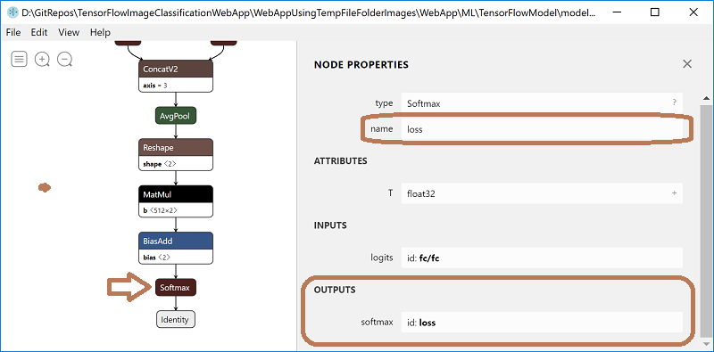

# Run with ML.NET C# code a TensorFlow model exported from Azure Cognitive Services Custom Vision


With **[ML.NET 1.0](https://www.nuget.org/packages/Microsoft.ML)** and related [NuGet packages for TensorFlow](https://www.nuget.org/packages/Microsoft.ML.TensorFlow/0.12.0) you can do the following:

- **Run/score a pre-trained TensorFlow model:** In ML.NET you can load a frozen TensorFlow model .pb file (also called “frozen graph def” which is essentially a serialized graph_def protocol buffer written to disk) and make predictions with it from C# for scenarios like image classification, object detection or any other. Here's a [Getting started sample on scoring a TensorFlow model](https://github.com/dotnet/machinelearning-samples/tree/master/samples/csharp/getting-started/DeepLearning_ImageClassification_TensorFlow) which is using the [Inception pre-trained TensorFlow model](https://storage.googleapis.com/download.tensorflow.org/models/inception5h.zip).

- **Transfer Learning on top of a pre-trained TensorFlow model:** You can re-use part of an already pre-trained TensorFlow model (such as the [Inception pre-trained TensorFlow model](https://storage.googleapis.com/download.tensorflow.org/models/inception5h.zip) ) to build a new model trained with additional samples for the final layer, such as trained with new images. For instance, see this [Tutorial on how to use Transfer Learning with ML.NET](https://docs.microsoft.com/en-us/dotnet/machine-learning/tutorials/image-classification) by using an already trained Image Classifier TensorFlow model to build a new custom model to classify images into different categories.

However, in the scenario where you want to train with your own images, the Transfer Learning approach can be a bit complex because even without taking into account the code implementation for transfer learning you'll need to find a base TensorFlow model to train on top of it which was originally trained with similar image types to your new images. Here's some specific examples to unsertand that statement: 

- For instance, the [TensorFlow Inception model](https://storage.googleapis.com/download.tensorflow.org/models/inception5h.zip) was trained with photos of may objects, animals, vegetables and people, so you could train the final layer, let's say with photos of 'super heroes', and the model will clasify properly images of specific 'super heroes'. In any case, the new images need to be of "similar type", as mentioned.

- But if the new training "image type" is very different, it won't work properly. For instance, if you try to do 'transfer learning' with ML.NET 1.0 (trains only on the final layer) and the [TensorFlow Inception model](https://storage.googleapis.com/download.tensorflow.org/models/inception5h.zip) with completely different image types, let's say [MINST images](https://en.wikipedia.org/wiki/MNIST_database) (so a blank image with just a handwritten digits/numbers), those images won't be recognized properly if the base TF model was the 'Inception model'. It might work right if you use a different TF pre-trained model that was trained with handwritten digits images, as the base model.

In any case, it can get tricky and you need to understand some complexity. For some custom scenarios might fit your needs since you have control of it but for other scenarios you might want a simpler approach.

Therefore, is there any other approach for .NET developers if you just want to quickly get started and simply try to run a TensorFlow model on your .NET application while being able to use your own images? (Let's say you want to train with very specific images from your industry or domain).

The answer is: "Of course there are additional approaches!"

You can use **Azure Cognitive Services Custom Vision** to train a TensorFlow model, then export it as a frozen TensorFlow model .pb file and finally run/score that model with ML.NET code in your end-user .NET application.

# The hypothetical business scenario for the sample app

The hypothetical business scenario for the sample app in this blog post is *pretty similar* to whay Snapchat and Amazon are testing and you can check out [here](https://www.theverge.com/2018/9/24/17896788/snapchat-amazon-shop-photos-partnership).

Basically, that feature would let users point their Snapchat camera at a physical product to then be redirected to an Amazon pop-up card for that product or something similar (so the user can easily buy what he just saw from a friend, etc.), as in the following image:


In my sample scenario I'll create a simplified web app with a Web API service that could also be used from a mobile app like in the Snapchat/Amazon scenario, but for simplicity's sake everything will work in a single web app for testing the feature, like shown in the architecture diagram below.

# The architecture

The advantage of using **ML.NET** to run a **TensorFlow model** exported from **Azure Cognitive Services Custom Vision** is that you don't have any mandatory on-line dependency/requirement with Azure. You can run/score that model in offline or online scenarios, wherever you want within your apps as long as the app is running .NET code (C#/F#/VB). 

It can be a desktop app (.NET Framework, WinForms, WPF), a web app (ASP.NET Core, ASP.NET), a service (WebAPI, WCF), etc. on Windows or Windows/Linux/Mac if using .NET Core.

- If using services, those services can be deployed on-premises, on Azure or anywhere.
- If using offline applications with no conectivity to Internet, the model will also work locally!
 
In this case, I'm running/scoring the TensorFlow model on an ASP.NET Core Razor web that is also working as a WebAPI service at the same time (so the service could also be consumed by a remote mobile app). Something like the following simplified scenario architecture:


That TensorFlow .pb model file that you see in the diagram (and the labels.txt codes/Ids) is what you create/train in Azure Cognitive Services Custom Vision then exporte as a frozen TensorFlow model file to be used by ML.NET C# code.

# Train a model in Azure Cognitive Services Custom Vision and exporting it as a frozen TensorFlow model file

Below are the steps I took using Azure Cognitive Services. You can take similar steps but targeting your own images and probably using many more types/objects, since I just used two different chair models. 

- 1. I created two labels (kind of product codes), one per object/furniture-type to be trained in the model:

        - `001-Green-Meeting-Chair-Redmond`
        - `002-High-Metal-Chair-Redmond`

- 2. Per object, I trained with around 90 photos for one chair and around 40 photos for the other chair.

- 3. Finally, export the TensorFlow .pb model file and the labels .txt 
    
        - Export from menu *Performance -> Export -> TensorFlow*. In that menu, "Android" just means that it is usually the format you need for Android apps

Those steps are visualized on the https://customvision.ai/ portal screenshot below.


For a detailed walkthrough on how to train your model with your own images in Azure Cognitive Services Custom Vision check out this tutorial:

-  [How to build an image classifier model with Custom Vision](https://docs.microsoft.com/en-us/azure/cognitive-services/custom-vision-service/getting-started-build-a-classifier)


# Define the ML.NET pipeline model configuration

In order to run/score a TensorFlow model in ML.NET you need to "wrap" it with an ML.NET model which in reality won't need to train in ML.NET since it was already trained as a TensorFlow model, but you need to define the image transformations (such as image resize, how to load the image file into the model, etc.) in the ML.NET model's pipeline.

This is basically the code you need to write and run just once in order to create the ML.NET model (ITransformer) wrapping the TensorFlow model:

```csharp
private ITransformer SetupMlnetModel(string tensorFlowModelFilePath)
{
    var pipeline = _mlContext.Transforms.ResizeImages(outputColumnName: TensorFlowModelSettings.inputTensorName,
                                                      imageWidth: ImageSettings.imageWidth, 
                                                      imageHeight: ImageSettings.imageHeight, 
                                                      inputColumnName: nameof(ImageInputData.Image))
           .Append(_mlContext.Transforms.ExtractPixels(outputColumnName: TensorFlowModelSettings.inputTensorName,
                                                      interleavePixelColors: ImageSettings.channelsLast,
                                                      offsetImage: ImageSettings.mean))
           .Append(_mlContext.Model.LoadTensorFlowModel(tensorFlowModelFilePath)
                                               .ScoreTensorFlowModel(
                                                      outputColumnNames: new[]{TensorFlowModelSettings.outputTensorName },
                                                      inputColumnNames: new[] { TensorFlowModelSettings.inputTensorName },
                                                      addBatchDimensionInput: false));

    ITransformer mlModel = pipeline.Fit(CreateEmptyDataView());

    return mlModel;
}
```

As mentioned, this code has to be run just once so you define the ML.NET model and how it has to load the TensorFlow model plus what transformations need the images to process.

The TensorFlow model pipeline above is defined based on the following settings:

```csharp
public struct ImageSettings
{
    public const int imageHeight = 227;
    public const int imageWidth = 227;
    public const float mean = 117;         //offsetImage
    public const bool channelsLast = true; //interleavePixelColors
}

// For checking tensor names, you can open the TF model .pb file with tools like Netron: https://github.com/lutzroeder/netron
public struct TensorFlowModelSettings
{
    // input tensor name
    public const string inputTensorName = "Placeholder";

    // output tensor name
    public const string outputTensorName = "loss";
}
```

You might think how could you know what size the images need to be re-sized and what are the TensorFlow model's input/output tensor names, right? - So for that you can explore the .pb file (frozen TensorFlow model) with a tool like [Netron](https://github.com/lutzroeder/netron) so you can see the names of the input and output tensors, like in the following screenshots:


**Input Tensor Name:**


You can see there the name of the input tensor plus the size of the image (width=227, eight=227).

**Output Tensor Name:**




# Working with in-memory images (NEW in ML.NET v1.1)

With ML.NET v1.0 whenever you were dealing with images and an ML.NET model you needed to work with files stored on a drive (or write a bunch of code hard to justify..). That was just a limitation of the API and IDataView supported types. However, we have fixed this feature in ML.NET 1.1 and there a new `ImageType` that can be used as the type for a column in a DataView, as in the following code:

```csharp
public class ImageInputData
{
    [ImageType(227, 227)]
    public Bitmap Image { get; set; }
}
```

This is great because it allows you to work with in-memory images.
In the scenario for this blog post, the image is coming through HTTP into my WebAPI, so I already have it as an in-memory object. With ML.NET 1.0 I needed to create a temporal image file on the drive, then load the image in the model and predict. But that was just a workaround, not efficient at all.

Now ,I can just take the image coming from HTTP into my WebAPI, convert to a BitMap type and process the image with the model and get my prediction (image classification returning its related "product code" in this case).

Here you can see the WebAPI simplified code, very straight forward!:

```csharp
[HttpPost]
[ProducesResponseType(200)]
[ProducesResponseType(400)]
[Route("classifyimage")]
public async Task<IActionResult> ClassifyImage(IFormFile imageFile)
{
    MemoryStream imageMemoryStream = new MemoryStream();
    await imageFile.CopyToAsync(imageMemoryStream);

    //Convert to Bitmap
    Bitmap bitmapImage = (Bitmap)Image.FromStream(imageMemoryStream);

    //Set the specific image data into the ImageInputData type used in the DataView
    ImageInputData imageInputData = new ImageInputData { Image = bitmapImage };

    //Predict code for provided image
    ImageLabelPredictions imageLabelPredictions = _predictionEnginePool.Predict(imageInputData);

    //Predict the image's label (The one with highest probability)
    ImagePredictedLabelWithProbability imageBestLabelPrediction
                        = FindBestLabelWithProbability(imageLabelPredictions, imageInputData);

    return Ok(imageBestLabelPrediction);
}
```

Note that since this is an ASP.NET Core web app (that method is a WebAPI method), I'm using our recommended/optimized way to run an ML.NET PredictionEngine which is to use the `PredictionEnginePool` injected into the controller's constructor using the *Dependency Injection* system in ASP.NET Core, as explained in this Tutorial:

- [Deploy a model in an ASP.NET Core Web API](https://docs.microsoft.com/en-us/dotnet/machine-learning/how-to-guides/serve-model-web-api-ml-net)

For further detailed info about why the `PredictionEnginePool` is recommended for scalable and multithreaded applications check this blog post that I wrote: 

- [How to optimize and run ML.NET models on scalable ASP.NET Core WebAPIs or web apps
](https://devblogs.microsoft.com/cesardelatorre/how-to-optimize-and-run-ml-net-models-on-scalable-asp-net-core-webapis-or-web-apps/)

Here are a couple of screenshots on how the app identifies/predicts the label (product code in this case) for the object in the provided photo. That action is called in machine learning as "Image classification":

**Select the image to identify:**

Note that even when those chairs for the two test-pictures are the same chairs than the ones used when training the model in Custom Vision, these particular photos/files in the 'TestImages' folder where NOT used to train the model. Could be the same chair taken in a different angle, different place or room, etc. :)


**The app shows you its related label (product code):**


# Show me the code!

Youcan get the code for this whole sample app this GitHub repo:

- https://github.com/CESARDELATORRE/TensorFlowImageClassificationWebApp

Eventually, we will probably publish this sample at the [ML.NET Samples GitHub repo](https://github.com/dotnet/machinelearning-samples), as well.


# Get started with ML.NET 1.0!


If you still don't know ML.NET, get started by exploring the following resources:

  * **Get started** with <a href="https://www.microsoft.com/net/learn/apps/machine-learning-and-ai/ml-dotnet/get-started">ML.NET here</a>. 
  * **Tutorials** and resources at the [Microsoft Docs ML.NET Guide](https://docs.microsoft.com/en-us/dotnet/machine-learning/)
  * **Sample apps** using ML.NET at the [machinelearning-samples GitHub repo](https://github.com/dotnet/machinelearning-samples)


Thanks and happy coding with [ML.NET](http://dot.net/ml)!

*Cesar de la Torre*

*Principal Program Manager*

*.NET and ML.NET product group*

*Microsoft Corp.*

